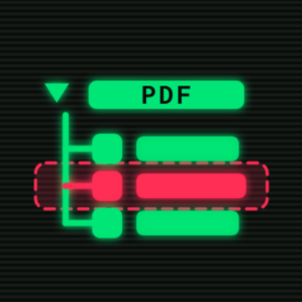

<p align="center">
  
</p>

<h1 align="center">PDF Inspector</h1>

<p align="center">
  A DevTools-style element inspector and editor for PDFs on Android
</p>

<p align="center">
  <a href="https://github.com/shardulvs/pdfinspector-android/releases/latest"></a>
  <a href="LICENSE"></a>
  
</p>

<p align="center">
  <a href="https://github.com/shardulvs/pdfinspector-android/releases/latest">GitHub Releases</a>
</p>

---

## At a glance

- **DevTools for PDFs**: every page's content stream is parsed into a navigable tree of text blocks, vector paths and images, grouped the way the PDF actually draws them. Switch between friendly labels and the raw content-stream operators.
- **Two-way selection**: tap an element on the page or tap its row in the tree, and the other side highlights to match, drawn as a clear bordered outline on the canvas.
- **Edit in place**: move and resize any element, recolor its fill or stroke as hex (the editor names the element's color space), and retype text. When the original font is missing a character, re-encode the line with a fallback font, bundled (Liberation) or taken from your device or imported. Changes are written straight back into the content stream, with full undo and redo.
- **Surgical delete**: remove exactly the element you picked by rewriting just its slice of the content stream, leaving the rest of the page untouched.
- **Save a copy, never the original**: your edited PDF is written to a new file through the system file picker, so the source document is left exactly as it was.
- **Smooth viewing**: pan and pinch-zoom, fit to width or height, a global zoom that carries across pages, and a full-screen mode.
- **Dockable inspector**: the inspector panel docks to the side in landscape or the bottom in portrait, resizes by dragging, and can be made transparent to see the page through it.
- **Material You**: Material 3 design with dynamic color on Android 12+, light / dark / system themes and a choice of accent colors.
- **Private and open**: open source, no accounts, no telemetry. No network access and no storage permission: files are opened and saved through Android's Storage Access Framework, so the app only ever touches the documents you explicitly pick.

## Install

| Channel | |
|---|---|
| [GitHub Releases](https://github.com/shardulvs/pdfinspector-android/releases/latest) | Signed APK |

## Build from source

Requires **JDK 17** (the project pins Java 17):

```bash
git clone https://github.com/shardulvs/pdfinspector-android.git
cd pdfinspector-android
JAVA_HOME=/path/to/jdk-17 ./gradlew assembleDebug
```

Output: `app/build/outputs/apk/debug/app-debug.apk`
